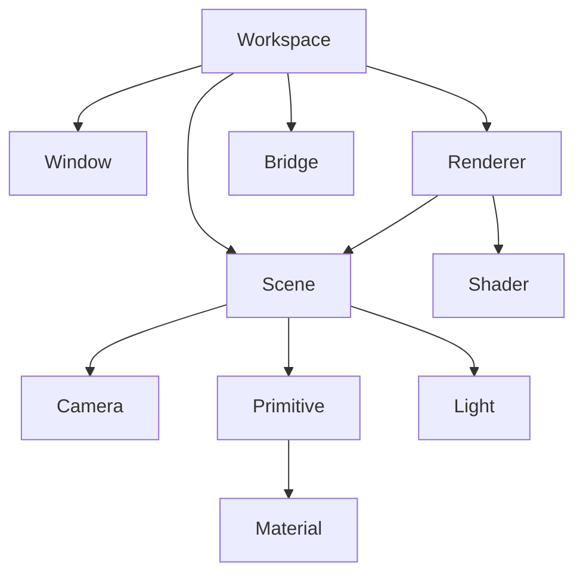

# HSE-020 — Repository Archaeology

## Summary

The repository is at the HSE-019 state. It has a functioning rendering foundation and a 3D room project (`room.hsc`).

## Subsystem Mapping

### 1. Window & Input (`core/window.h`)
-   Wraps `GLFWwindow`.
-   Supports `vsync`, `resizeCallback`.
-   **Missing**: `getMousePosition()`, `isMouseButtonPressed()`, `isKeyPressed()`.
-   **Impact**: Must extend `Window` to provide input queries for navigation and picking.

### 2. Camera (`scene/camera.h`)
-   Owns `View` and `Projection` matrices.
-   `m_orbitEnabled` exists but is automated by `deltaTime`.
-   **Missing**: `translate(vec3)`, `zoom(float)`, `manualOrbit(yaw, pitch)`.
-   **Impact**: Must implement manual navigation methods.

### 3. Renderer (`renderer/renderer.h`)
-   Hardcoded shaders in `renderer.cpp`.
-   Draws everything in a single pass.
-   **Missing**: Support for "Highlight" uniform.
-   **Impact**: Need a new uniform `uSelected` in the fragment shader to tint the selected object.

### 4. Bridge (`bridge/bridge.h`)
-   Parses commands from NDJSON.
-   **Impact**: Can be used to drive manipulation if keyboard input is too complex to implement natively in one go.

### 5. Workspace (`src/workspace_main.cpp`)
-   The entry point for project-based viewing.
-   **Impact**: This will be the "Main Controller" for interactive state.

## Dependency Map

## Potential Picking Candidates

1.  **Ray-Casting**: Mathematically clean. Requires Mouse-to-World conversion.
2.  **Color-ID Picking**: Easiest for complex meshes. Requires multiple render passes or side-textures.
3.  **HSE Choice**: Ray-Casting is preferred. Primitives are simple (Quads, Cubes), so intersection tests are low-cost and don't require GPU-side architectural changes.
