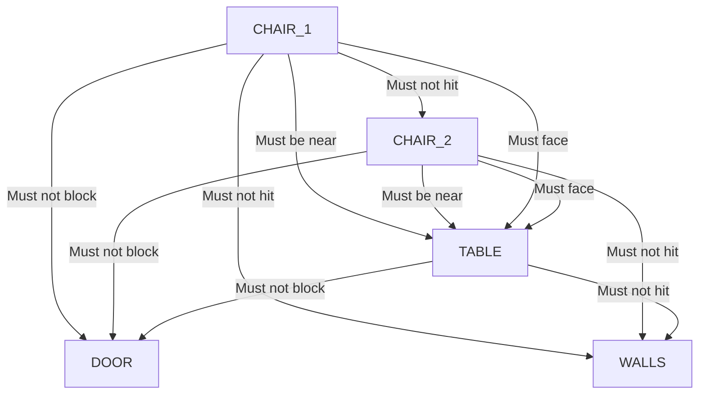

# HSE-022 — Constraint Graph

## Entities
- `TABLE` (`table_top` + legs)
- `CHAIR_1` (seat + back)
- `CHAIR_2` (seat + back)
- `DOOR` (volume at `z=3`, `x=[-1,1]`)
- `WALLS` (boundaries at `+/-3`)

## Relationships & Dependencies

## Conflict Evaluation
- If `TABLE` moves to `x=2`, `CHAIR_2` must move to `x=3.2` to maintain proximity.
- **Conflict**: `CHAIR_2` @ `x=3.2` intersects `WALL_RIGHT` @ `x=3.0`.
- **Resolution**: Adjust `TABLE` position or `CHAIR_2` offset.

- If `TABLE` moves to `z=2.8`, it intersects `DOOR`.
- **Conflict**: `DOOR` access violated.
- **Resolution**: Move `TABLE` back to `z <= 1.8` (allowing for table depth).
